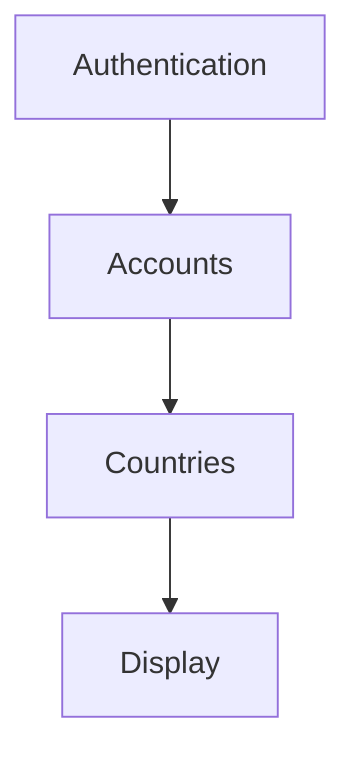

# ios-sdk-v6

The *ios-sdk-v6* lets you communicate between native ios and *Insiteo* unity environment.
This guide will help you integrate the *ios-sdk-v6* into an existing ios native app.

## Summary
- [Installation](#installation)
- [Usage](#usage)

## Installation

You may have received 'ios_sdk_v6' framework.
It is currently not available through CocoaPods.

1. Add ios_sdk_v6 framework in your app's target 'Frameworks, Libraries, and Embedded Content' section.

2. Ensure your app has both capabilities *(Signing and Capabilities menu)* **Sign in with Apple** and **Push Notifications**

3. In your project build settings, set *Enable Bitcode* to ```No```

4. In your scheme settings, disable Metal API validation.

    

5. Make sure to add those keys in info.plist:
    - Privacy - BluetoothAlwaysUsageDescription
    - Privacy - CameraUsageDescription
    - Privacy - BluetoothPeripheralUsageDescription
    - Privacy - LocationWhenInUsageDescription
    - Privacy - LocationAlwaysAndWhenInUseUsageDescription

## Usage

### Display a site

Following instructions will lead you to display a site through ios-sdk-v6 methods.

 1. Initialize Unity in your AppDelegate file.

```swift
import ios_sdk_v6

func application(_ application: UIApplication, didFinishLaunchingWithOptions launchOptions: [UIApplication.LaunchOptionsKey: Any]?) -> Bool {

	SDKManager.shared.startUnity()
	return true
}
```

2. In your ViewController file, Register (at least) following callbacks to display Unity View, retrieve datas and display the Site selector.


*Illustrating schema of following code steps*

```swift
var accounts: [Account]!
var countries: [Country]!
var sites: [Site]!

override func viewDidLoad() {
	super.viewDidLoad()
	
	// Callback observers
	NotificationCenter.default.addObserver(self, selector: #selector(initDone(_:)), name: NSNotification.Name("SDKInitSDKOK") , object: nil)
	NotificationCenter.default.addObserver(self, selector: #selector(onAuthenticationSuccess(_:)), name: NSNotification.Name("SDKAuthenticationOK") , object: nil)
	NotificationCenter.default.addObserver(self, selector: #selector(onAuthenticationError(_:)), name: NSNotification.Name("SDKAuthenticationError") , object: nil)
	NotificationCenter.default.addObserver(self, selector: #selector(onAccountServerOK(_:)), name: NSNotification.Name("SDKAccountServerOK"), object: nil)
}

@objc func initDone(_ : NSNotification) {

	SDKManager.shared.showUnitySubView(view: self.view)
	SDKManager.shared.authenticateUserO365()
}

@objc func onAuthenticationSuccess(_ n: NSNotification) {

	guard let data = n.userInfo?["data"] as? [Dictionary<String, Any>] else { return }

  // SDKManager provides custom types (Account, Country..) to make easier data manipulation.
	self.accounts = SDKManager.shared.getAccountObjects(dict: data)

	let serverUrl = accounts[0].ServerUrl
	let dedicatedText = accounts[0].DedicatedText
	let iconURL = accounts[0].IconURL

	SDKManager.shared.selectAccount(serverUrl: serverUrl, dedicatedText: dedicatedText, iconURL: iconURL)
}

@objc func onAccountServerOK(_ n: NSNotification) {

	SDKManager.shared.getCountries()
}

@objc func onCountriesReceived(_ n: NSNotification) {
	guard let data = n.userInfo?["data"] as? [Dictionary<String, Any>] else { return }

	self.countries = SDKManager.shared.getCountryObjects(dict: data)
	let countryId = self.countries[0].Identifier

	SDKManager.shared.displaySiteSelector(countryId: countryId)
}
```

From now on, you should be able to select a Site and access Insiteo 3D view.
SDK Methods allows you to go further and bypass the Site selector UI.

#### SDK Methods

SDKManager can be accessed from anywhere through ```SDKManager.shared```.

Here is a list of available methods.
- [startUnity](#startunity)
- [stopUnity](#stopunity)
- [showUnitySubView](#showunitysubview)
- [authenticateUserO365](#authenticateusero365)
- [authenticateClassic](#authenticateclassic)
- [selectAccount](#selectaccount)
- [getCountries](#getcountries)
- [getSitesForCountry](#getsitesforcountry)
- [getDetailedSiteContent](#getdetailedsitecontent)
- [logInUnity](#loginunity)
- [displayCountrySelector](#menu-displaycountryselector)
- [displaySiteSelector](#menu-displaysiteselector)
- [displayFloorSelector](#menu-displayfloorselection)
- [displayFloor](#menu-displayfloor)
- [displayArea](#menu-displayarea)
- [setToolBarVisibility](#ui-settoolbarvisibility)
- [setTopBarVisibility](#ui-settopbarvisibility)
- [setLocationButtonVisibility](#ui-setlocationbuttonvisibility)
- [setFloorButtonsVisibility](#ui-setfloorbuttonsvisibility)
- [setCompassButtonVisibility](#ui-setcompassbuttonvisibility)
- [setSearchBarVisibility](#ui-setsearchbarvisibility)
- [setDisplayModeVisibility](#ui-setdisplaymodevisibility)
- [useSpecificOnObjectSelect](#usespecificonobjectselect)
- [startNavigationToArea](#startnavigationtoarea)
- [stopNavigation](#stopnavigation)
- [getAccountObjects](#getaccountobjects)
- [getCountryObjects](#getcountryobjects)
- [getSiteObjects](#getsiteobjects)
- [getSitecontentObject](#getsitecontentobject)

##### startUnity

Triggers [SDKInitSDKOK](#sdkinitsdkok) callback when init is done.
```swift
public func startUnity(application: UIApplication, currentUnityController: UnityAppController)
```

##### stopUnity

No triggered callback.
```swift
public func stopUnity(application: UIApplication, currentUnityController: UnityAppController)
```

##### showUnitySubView

No triggered callback.
```swift
public func showUnitySubView(view: UIView)
```

##### authenticateUserO365

Triggers [SDKAuthenticationOK](#sdkauthenticationok) callback on success, otherwise triggers [SDKAuthenticationError](#sdkauthenticationerror).
```swift
// Open browser and handle Oauth2 login.
public func authenticateUserO365()
```

##### authenticateClassic

Triggers [SDKAuthenticationOK](#sdkauthenticationok) callback on success, otherwise triggers [SDKAuthenticationError](#sdkauthenticationerror).
```swift
// Company account.
public func authenticateClassic(login: String, pwd: String)
```

##### selectAccount

Triggers [SDKAccountServerOK](#sdkaccountserverok) callback.
```swift
public func selectAccount(serverUrl: String, dedicatedText: String, iconURL: String)
```

##### getCountries

Triggers [SDKCountriesReceived](#sdkcountriesreceived) callback on success, otherwise triggers [SDKModelError](#sdkmodelerror).
```swift
public func getCountries()
```

##### getSitesForCountry

Triggers [SDKSitesReceived](#sdksitesreceived) callback on success, otherwise triggers  [SDKModelError](#sdkmodelerror).
```swift
public func getSitesForCountry(countryIdentifier: String)
```

##### getDetailedSiteContent

Triggers [SDKSiteContentReceived](#sdksitecontentreceived) callback.
```swift
public func getDetailedSiteContent(siteIdentifier: String)
```

##### logInUnity

No triggered callback.
```swift
// Send log message to Unity (on 3D view).
public func logInUnity(message: String)
```

##### [Menus] displayCountrySelector

No triggered callback.
```swift
public func displayCountrySelector()
```

##### [Menus] displaySiteSelector

No triggered callback.
```swift
public func displaySiteSelector(countryId: String)
```

##### [Menus] displayFloorSelector

No triggered callback.
```swift
public func displayFloorSelector(countryId: String, siteId: String, buildingId: String)
```

##### [Menus] displayFloor

No triggered callback.
```swift
public func displayFloor(siteId: String, buildingId: String, floorId: String)
```


##### [Menus] displayArea

Triggers [SDKObjectSelected](#sdkobjectselected) callback if [useSpecificOnObjectSelect](#usespecificonobjectselected) has been set to `YES`.
```swift
public func displayArea(siteId: String, buildingId: String, floorId: String, areaId: String)
```

##### [UI] setToolBarVisibility

No triggered callback.
```swift
public func setToolbarVisibility(visibility: Bool)
```

##### [UI] setTopBarVisibility

No triggered callback.
```swift
public func setTopBarVisibility(visibility: Bool)
```

##### [UI] setLocationButtonVisibility

No triggered callback.
```swift
public func setLocationButtonVisibility(visibility: Bool)
```

##### [UI] setFloorButtonsVisibility

No triggered callback.
```swift
public func setFloorButtonsVisibility(visibility: Bool)
```

##### [UI] setCompassButtonVisibility

No triggered callback.
```swift
public func setCompassButtonVisibility(visibility: Bool)
```

##### [UI] setSearchBarVisibility

No triggered callback.
```swift
public func setSearchBarVisibility(visibility: Bool)
```

##### [UI] setDisplayModeVisibility

No triggered callback.
```swift
// 2D / VR / 3D View Mode button
public func setDisplayModeVisibility(visibility: Bool)
```

##### useSpecificOnObjectSelect

No triggered callback.
```swift
// Enable or disable callback when displayArea() is called.
// Parameter should be "YES" or "NO".
public func useSpecificOnObjectSelect(status: String)
```

##### startNavigationToArea

No triggered callback.
```swift
public func startNavigationToArea(areaId: String)
```

##### stopNavigation

No triggered callback.
```swift
public func stopNavigation(value: String)
```

##### getAccountObjects

No triggered callback.
```swift
// Create an Account object list from a [Dictionary<String, Any>].
public func getAccountObjects(dict: [Dictionary<String, Any>]) -> [Account]?
```

##### getCountryObjects

No triggered callback.
```swift
// Create a Country object list from a [Dictionary<String, Any>].
public func getCountryObjects(dict: [Dictionary<String, Any>]) -> [Country]?
```

##### getSiteObjects

No triggered callback.
```swift
// Create a Site object list from a [Dictionary<String, Any>].
public func getSiteObjects(dict: [Dictionary<String, Any>]) -> [Site]?
```

##### getSitecontentObject

No triggered callback.
```swift
// Create a SiteContent object from a Dictionary<String, Any>.
public func getSiteContentObject(dict: Dictionary<String, Any>) -> SiteContent?
```

#### SDK Callbacks

For many SDK actions, you will be able to receive a callback.
Here is a list of available callbacks:
- [SDKInitSDKOK](#sdkinitsdkok)
- [SDKAuthenticationOK](#sdkauthenticationok)
- [SDKAuthenticationError](#sdkauthenticationerror)
- [SDKBrowserClosed](#sdkbrowserclosed)
- [SDKAccountServerOK](#sdkaccountserverok)
- [SDKCountriesReceived](#sdkcountriesreceived)
- [SDKSitesReceived](#sdksitesreceived)
- [SDKSiteContentReceived](#sdksitecontentreceived)
- [SDKDisplayOK](#sdkdisplayok)
- [SDKDisplayError](#sdkdisplayerror)
- [SDKObjectSelected](#sdkobjectselected)
- [SDKModelError](#sdkmodelerror)

##### SDKInitSDKOK

SDK is initialized.
> Contains string

##### SDKAuthenticationOK

Authentication success.
> Contains servers list (accounts) of type `[Dictionary<String, Any>]`.
```json
[{
        "AccountName": String,
        "ServerUrl": String,
        "IconURL": String,
        "DedicatedText": String
}]
```
*Note that SDKManager also provide an `Account` object to make easier data manipulation, see [Example](#example).*

##### SDKAuthenticationError

Authentication error.
> May contain error message

##### SDKBrowserClosed

Browser has been closed.
> May contain string message

##### SDKAccountServerOK

A server (account) has been selected.
> May contain string message

##### SDKCountriesReceived

Available countries list has been received.
> Contains countries list of type `[Dictionary<String, Any>]`.
```json
[{
        "Label": String,
        "Comment": String,
        "Identifier": String,
        "CreationDate": String,
        "ModificationDate": String
}]
```

*Note that SDKManager also provide a `Country` object to make easier data manipulation, see [Example](#example).*

##### SDKSitesReceived

Available sites for account have been received.
> Contains sites list of type `[Dictionary<String, Any>]`.
```json
[{
        "Identifier": String,
        "Label": String,
        "Address": String
}]
```

*Note that SDKManager also provide a `Site` object to make easier data manipulation, see [Example](#example).*

##### SDKSiteContentReceived

Site content have been received.
> Contains site content of type `Dictionary<String, Any>`.
```json
{
    "Identifier": String,
    "Label": String,
    "Address": String,
    "Buildings": [{
            "Identifier": String,
            "Label": String,
            "Address": String,
            "Floors": [{
                    "Identifier": String,
                    "FloorNumber": Int,
                    "Label": String,
                    "Surface": Int,
                    "Areas": [{
                            "Identifier": String,
                            "SubAreas": [{
                                    "Identifier": String,
                                    "Label": String
                            }],
                            "Label": String,
                            "Capacity": Int,
                            "TypeId": String,
                            "Email": String,
                            "Url": String
                    }]
            }]
    }]
}
```

*Note that SDKManager also provide a `SiteContent` object to make easier data manipulation, see [Example](#example).*

##### SDKDisplayOK

Scene display is ready.
> May contain string message

##### SDKDisplayError

An error occurred while trying to display a scene.
> Contains an error string message

##### SDKObjectSelected

An object (area/desk) has been selected
> Contains object id

##### SDKModelError

List of countries/sites not received
> May contain error string message

---

#### Example

You can listen for callbacks using Notification observers:
```swift
NotificationCenter.default.addObserver(self, selector: #selector(didReceiveData(_:)), name: NSNotification.Name("<CallbackName>"), object: nil)
```

Example handling method:
```swift
@objc func didReceiveData(_ n: NSNotification) {
    guard let accounts = n.userInfo?["data"] as? [Dictionary<String, Any>] else { return }
    
    var accountName = accounts[0]["AccountName"] as! String
}
```

Alternatively, using custom SDKManager objects `Account`, `Country`, `Site`, `SiteContent`:

```swift
@objc func didReceiveData(_ n: NSNotification) {
    guard let accounts = n.userInfo?["data"] as? [Dictionary<String, Any>] else { return }
    
    var accountsObj = SDKManager.shared.getAccountObjects(dict: accounts)
    var accountName = accountsObj[0].AccountName
}
```
